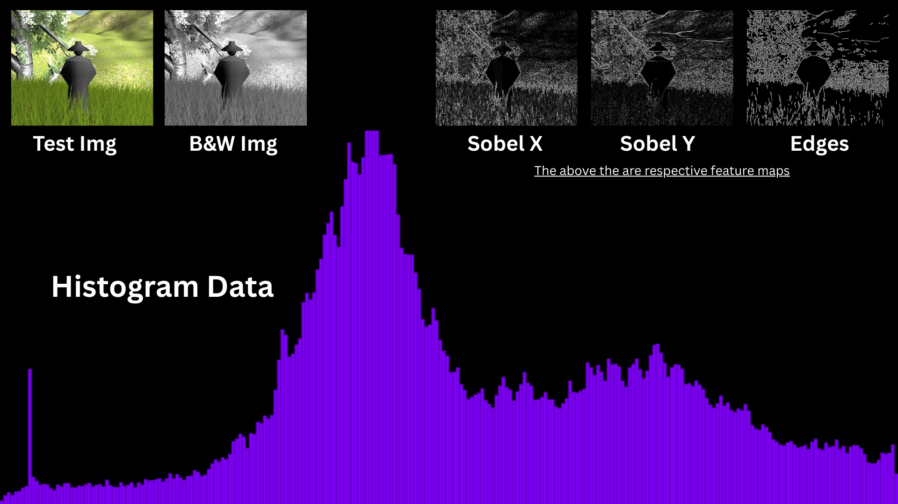

# Basic
As we know image is basically a grid of tiny dots called pixels, each of these pixels takes three values to show respective color which are R for red , G for green and B for blue. Each value goes from 0 to 255 capable of showing different colors.

# Grascaled Image
A Grayscaled ( B & W or Black and White ) image basically has only two values per pixel and its values represent White , Black and shades of Gray. The computer has its respective method of converting colored image into one number which is : 
Gray = 0.299R + 0.587G + 0.114B  
The grayscaled images are very helpful providing help in fast processing , feature detection etc.

# Feature maps
Features are bascially something in a image such as Edges , Lines etc. A feature map is what highlights these features in a image and is present in image form as well where bright area is where the respective feature is present and dark area shows its absence.

# Sobel Operator
Edge detection, An edge is basically where the brightness changes suddenly and Sobel operator is what detects edges by checking the itensity of pixel if it changes or not. 
Sobel X : It is vertical edge detection and detects the change in brightness from left to right. 
Sobel X : It is horizontal edge detection and detects the change in brightness from top to bottom. 
Edge Map : It is combined of both and is in all direction not just vertical or horizontal. It has a respective formula which is : 
Edge = sqrt( (SobelX)^2 + (SobelY)^2 ) 
It gives all the edges and clear boundries in an image.

# Histogram Data of an Image
It is a graph which shows how bright and dark the image is. Basically the way it works is it counts how many pixel has 0 value , how many has 1 , up to 255.

